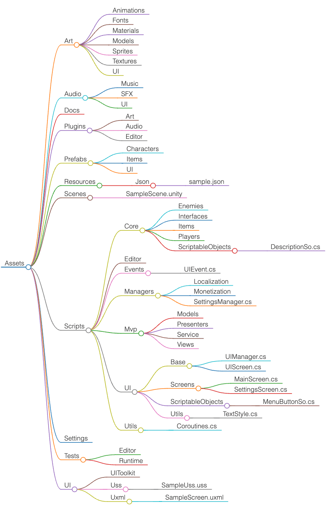

# UnityBaseTemplate2DURP


<p align="center">
  
  <br/>
  <sub><sup>Photo by <a href="https://unsplash.com/@androchentw?utm_content=creditCopyText&utm_medium=referral&utm_source=unsplash">Andro Chen</a> on <a href="https://unsplash.com/photos/av_vGjHnK-g?utm_content=creditCopyText&utm_medium=referral&utm_source=unsplash">Unsplash</a>
  </sup></sub>
</p>

## Overview

* Ref: [unity-playground](https://github.com/androchentw/unity-playground)

## Folder Structure



Ref

- [2d-beginner-adventure-game](https://github.com/androchentw/unity-tutorial-projects/tree/main/2d-beginner-adventure-game/Assets/UnityTechnologies/Final/Scripts/Final)
- [2d-game-kit](https://github.com/androchentw/unity-tutorial-projects/tree/main/2d-game-kit/Assets/2DGamekit/Scripts/Core)
- dragon-crashers
  - [Prefabs/Managers](https://github.com/androchentw/unity-tutorial-projects/blob/main/dragon-crasashers/Assets/Prefabs/Managers)
  - [Resources/GameData/Skills](https://github.com/androchentw/unity-tutorial-projects/tree/main/dragon-crashers/Assets/Resources/GameData/Skills)
  - [ScriptTemplates](https://github.com/androchentw/unity-tutorial-projects/blob/main/dragon-crashers/Assets/ScriptTemplates/81-C%23%20Script-NewBehaviourScript.cs.txt)
  - [Scripts/Gameplay/Data](https://github.com/androchentw/unity-tutorial-projects/tree/main/dragon-crashers/Assets/Scripts/Gameplay/Data)
  - [Scripts/ScriptableObjects](https://github.com/androchentw/unity-tutorial-projects/tree/main/dragon-crashers/Assets/Scripts/ScriptableObjects)

```text
Assets/
├── Art/
│   ├── Animations/
│   ├── Fonts/
│   ├── Materials/
│   ├── Models/
│   ├── Sprites/
│   ├── Textures/
│   ├── UI/
├── Audio/
│   ├── Music/
│   ├── SFX/
│   ├── UI/
├── Docs/
├── Plugins/
│   ├── Art/
│   ├── Audio/
│   ├── Editor/
│   │   ├── M Studio/
│   │       ├── Colourful Hierarchy Category GameObject/
│   ├── Runtime/
├── Prefabs/
│   ├── Characters/
│   ├── Items/
│   ├── UI/
├── Resources/
│   ├── Json/
│       └── sample.json
├── Scenes/
│   └── SampleScene.unity
├── Scripts/
│   ├── Core/
│   │   ├── Enemies/
│   │   ├── Interfaces/
│   │   ├── Items/
│   │   ├── Players/
│   │   ├── ScriptableObjects/
│   │       └── DescriptionSo.cs
│   ├── Editor/
│   ├── Events/
│   │   └── UIEvent.cs
│   ├── Managers/
│   │   ├── Localization/
│   │   ├── Monetization/
│   │   └── SettingsManager.cs
│   ├── Mvp/
│   │   ├── Models/
│   │   ├── Presenters/
│   │   ├── Services/
│   │   ├── Views/
│   ├── UI/
│   │   ├── Base/
│   │   │   ├── UIManager.cs
│   │   │   └── UIScreen.cs
│   │   ├── Screens/
│   │   │   ├── MainScreen.cs
│   │   │   └── SettingsScreen.cs
│   │   ├── ScriptableObjects/
│   │   │   └── MenuButtonSo.cs
│   │   ├── Utils/
│   │       └── TextStyles.cs
│   ├── Utils/
│       └── Coroutines.cs
├── Settings/
├── Tests/
│   ├── Editor/
│   ├── Runtime/
├── UI/
│   ├── UIToolkit/
│   │   ├── Common/
│   │   ├── UnityThemes/
│   ├── Uss/
│   │   └── SampleUss.uss
│   ├── Uxml/
│       └── SampleScreen.uxml
├── Settings/
├── Tests/
│   ├── Editor/
│   ├── Runtime/
```

<details>
  <summary>Folder Structure Bullet Items</summary>
- Assets
  - Art
    - Animations
    - Fonts
    - Materials
    - Models
    - Sprites
    - Textures
    - UI
  - Audio
    - Music
    - SFX
    - UI
  - Docs
  - Plugins
    - Art
    - Audio
    - Editor
  - Prefabs
    - Characters
    - Items
    - UI
  - Resources
    - Json
      - sample.json
  - Scenes
    - SampleScene.unity
  - Scripts
    - Core
      - Enemies
      - Interfaces
      - Items
      - Players
      - ScriptableObjects
        - DescriptionSo.cs
    - Editor
    - Events
      - UIEvent.cs
    - Managers
      - Localization
      - Monetization
      - SettingsManager.cs
    - Mvp
      - Models
      - Presenters
      - Service
      - Views
    - UI
      - Base
        - UIManager.cs
        - UIScreen.cs
      - Screens
        - MainScreen.cs
        - SettingsScreen.cs
      - ScriptableObjects
        - MenuButtonSo.cs
      - Utils
        - TextStyle.cs
    - Utils
      - Coroutines.cs
  - Settings
  - Tests
    - Editor
    - Runtime
  - UI
    - UIToolkit
    - Uss
      - SampleUss.uss
    - Uxml
      - SampleScreen.uxml
</details>

## Contribute

* [LICENSE](LICENSE)
* [CODE_OF_CONDUCT](CODE_OF_CONDUCT.md)
* [CONTRIBUTING](CONTRIBUTING.md)

<a href="https://github.com/an/template-playground/graphs/contributors">
  
</a>

<!-- Links -->
